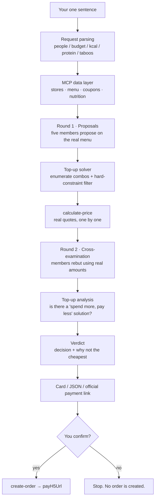

<div align="center">

# McDonald's Roundtable · `mcd-roundtable`

**Say one sentence. Five AI personas start arguing. What comes out is an order you can actually place.**

A **multi-agent meal-decision skill** built on **McDonald's China official MCP Server**
(`mcd-mcp`, Model Context Protocol) — the models do the *arguing*, the official API does the *math*.

Seats: 💰 Savings Minister · 🏋️ Macro Coach · 🍔 Classics Loyalist · 🌿 Lighter-Options Specialist · 🎲 Novelty Seeker


[简体中文](./README.md) · **English**

</div>


> The animation above is the program's actual output on the **real McDonald's MCP**, unedited.
> Store, menu, coupons and prices all come from live endpoints.

---

## At a glance

| | |
| --- | --- |
| **What it is** | A **multi-agent ordering decision CLI** / AI Agent Skill on top of **McDonald's official MCP** |
| **One-line summary** | Five council members with conflicting agendas debate your request, cross-examine each other using real official prices, and a deterministic solver issues the final call |
| **What problem it solves** | Lunch has no single correct answer. Price, protein, craving and health are four conflicting stances — collapse them into one prompt and you get mush |
| **How it differs from "AI ordering"** | Most tools let the model *guess* prices. Here every number comes from the official `calculate-price` endpoint. The model argues; it never touches the money |
| **Need a token?** | No. `--demo` runs the entire pipeline offline with zero configuration (bundled payloads are byte-shape-identical to the live API) |
| **Need an LLM?** | No. Without an API key it falls back to a rule-based brain (`HeuristicBrain`) with full functionality |
| **Can it really place an order?** | Yes. `--order` calls the official `create-order` and returns the **official McDonald's payment link**. This project never touches payment credentials |
| **Stack** | Python 3.10+ · MCP Streamable HTTP · no external services, 3 dependencies (`mcp` / `openai` / `rich`) |
| **Output formats** | Terminal · SVG decision card · single-file zero-JS HTML report · structured JSON for other agents |

---

## What it actually does

There are already plenty of one-line ordering tools. **This one targets a different problem: lunch has no single right answer.**

What matters to you is price, or protein, or "I just want *that* one", or plain boredom with the usual — four mutually conflicting stances. Squeeze them into a single prompt and the model averages them into mush.

So they are split into **five personas that argue**:

| Member | Stance | Weapon |
| :---: | --- | --- |
| 💰 **Savings Minister** | every coupon must be used | the **real discount amount** returned by the official pricing API |
| 🏋️ **Macro Coach** | protein first, watch the sodium | official nutrition table (kcal / protein / sodium) |
| 🍔 **Classics Loyalist** | the classics are classics for a reason | evergreen items and combo structure in the menu |
| 🌿 **Lighter-Options Specialist** | less oil, less sodium, swap when possible | substitution options + sodium comparison |
| 🎲 **Novelty Seeker** | you order the same thing every time | official "popular / signature" category tags (deliberately avoiding the mainstream picks) |

After the argument, a neutral moderator — a **deterministic solver**, not a language model — rules.

---

## The two hard rules

> ### The models do the arguing. The official MCP does the arithmetic.

**Rule 1 — Never mention anything that is not on the menu.**
Proposals may only be drawn from the real menu returned by `query-meals`. Invented items are dropped.

**Rule 2 — Prices may only come from the official `calculate-price`. Models are not allowed to estimate.**
Coupon stacking is easy to get wrong, and a wrong total costs real money. So:

* local menu prices are used only for **coarse ranking**, to pick the Top-K candidate combos;
* each candidate is then **actually priced** by the official `calculate-price` endpoint;
* final ordering, discount amounts and "spend a bit more to save" advice all come from the official response;
* if the pricing endpoint is unavailable, the fallback price is explicitly labelled `local-fallback` — it **never impersonates an official price**.

---

## Three details you won't find elsewhere

### 1️⃣ The counter-intuitive answer: adding an item makes it cheaper

The pricing API returns how much is still missing to reach the next discount tier (`enjoyable.balance`).
When that gap is smaller than the discount increment, **buying one more item lowers the total**.

```
💡 Spend ¥3.2 more to cross into the next tier — net ¥2.8 cheaper (official quote)
```

Net saving = next-tier discount − discount already applied − extra spent to cross the tier.
**All three terms must be subtracted.** Drop any one and "spend ¥3.2 more" gets reported as "¥6 cheaper" —
and that sentence drives a purchase decision.

A human cannot compute this by hand, but it is real. The program actively looks for it and rewrites the verdict when it finds one.

### 2️⃣ It explains why it did *not* pick the cheapest option

```
Rationale  This order costs ¥1.2 more than the cheapest plan (¥64.5),
           in exchange for +150 kcal per person. Say the word and I'll switch to lowest price.
```

A tool that silently picks the expensive option is not trustworthy.
So whenever a **quantified** reason exists, it must be stated. If none exists, it stays quiet rather than inventing one.

### 3️⃣ Unmet constraints are reported, not papered over

A "protein ≥ 30 g" target may be unreachable at the current budget. Instead of quietly relaxing it to 25 g and declaring success:

```
⚠ Protein ≈ 26 g/person, target of 30 g not met
  (this is the closest combination on the menu within the current calorie and budget caps)
```

When the nutrition table does not cover an item, it reports "cannot verify" rather than treating the gap as 0.

---

## Live mode in practice

With a token configured, the same pipeline runs against the official McDonald's MCP:


Add `--share` to export the same verdict as a self-contained SVG card:


> **About "discount —":** not a bug. Coupons on that account were single-item deals
> (e.g. "¥9.9 medium iced americano") that do not match the selected items, and the official
> endpoint faithfully returns 0. This tool **never fabricates a discount** — whether a coupon
> applies is decided by `calculate-price`.

---

## Turn the verdict into a shareable page

Terminal output has one fatal flaw: **it does not travel**. Screenshots carry a terminal frame and a scrollbar; pasted text loses all layout.

So there is `--html`, which exports the whole session as a **single-file web page**:

```bash
mcd-roundtable "lunch, under 35, use my coupons" --city 郑州 --keyword 正弘城 --html verdict.html
```


The five members appear one after another (each with a dedicated colour badge), ending in a receipt with a **serrated tear edge**. If the run used `--order`, the button at the bottom turns gold and links straight to the official McDonald's payment page.

Three deliberate engineering choices:

| Choice | Why |
| --- | --- |
| **Zero JavaScript** | All animation is CSS `animation-delay`; content is rendered into the HTML at generation time. **It stays fully readable with JS disabled** — no blank page. |
| **Everything escaped** | Item names come from the MCP; the request comes from user input. Interpolating them raw breaks layout (`&`, `<` in names) and invites injection, so everything goes through `html.escape`. |
| **Single file, zero external requests** | No CDN, no web fonts, no `<script src>`. Works offline, from a USB stick, or as an email attachment. |

> Don't want to run anything? Open the sample: [`assets/sample-verdict.html`](./assets/sample-verdict.html)

---

## Pitfalls we actually hit (for anyone integrating the McDonald's MCP)

This section may save you more time than the code itself. Every item below was **genuinely hit and verified**.

### Pitfall 1 — A wrong field name does not error, it silently returns 0

The items element field for `calculate-price` / `create-order` is **`productCode`**:

```jsonc
// ✗ No error. price silently comes back as 0
{"items": [{"mealCode": "1440", "quantity": 1}]}
{"items": [{"code": "1440", "quantity": 1}]}

// ✓ Correct
{"items": [{"productCode": "1440", "quantity": 1}]}
```

This is the hardest class of bug: **no exception, no error code, just a zero.**

### Pitfall 2 — Money units are not consistent

| Endpoint | Unit |
| --- | --- |
| `query-meals` → `currentPrice` | **yuan** (string) |
| `calculate-price` → `price` / `discount` / `subtotal` | **fen** (integer, 1/100 yuan) |

Mixing them turns a "¥29 combo" into "¥0.29". This project normalises to yuan at the client layer and only moves yuan internally.

### Pitfall 3 — In-store ordering requires `takeWayCode`

With `orderType=1` (in-store / drive-thru), omitting `takeWayCode` fails with **`600042`**.
The value can **only** come from `takeWayList[].code` returned by `calculate-price`:

```jsonc
"takeWayList": [
  {"code": "eat-in",        "title": "堂食", "subtitle": "店内用餐"},
  {"code": "take-in-store", "title": "外带", "subtitle": "店内自提"}
]
```

Call `calculate-price` first, then pass the code to `create-order` to get a `payH5Url`.
(`cancel-order` is the same story — `cancelReasonCode` is required, missing it returns 400.)

### Pitfall 4 — Four different response shapes; `json.loads` will not work

| Shape | Example endpoint |
| --- | --- |
| Pure JSON | `query-my-account` |
| Prose + JSON | `query-nearby-stores`, `calculate-price` |
| Markdown | `available-coupons`, `campaign-calendar`, `query-my-coupons` |
| toon compact table | `list-nutrition-foods` |

`calculate-price` in particular prefixes the JSON with a large `# API Response Information` block.
`json.loads` on the whole string always fails; you must `raw_decode` starting at the first `{`.

The toon table looks like this (`[160]` is the row count; the header does not start with `{` and needs separate handling):

```
[160]{productName,nutritionDescription,energyKj,energyKcal,protein,...}:
  猪柳麦满分,null,1288,308,16,16,24,781,213
```

### Pitfall 5 — `query-nearby-stores` needs **both** `city` and `keyword`

Passing only one returns `600058`. Also, `beType=2` (delivery) against this endpoint returns
`600046 仅支持到店和得来速` (in-store and drive-thru only).

### Pitfall 6 — `query-my-coupons` has **no** `couponId` at all

It returns a human-readable list with title, discounted price and validity window only:

```markdown
## 9.9元中杯冰美式
- **优惠**: ¥9.9 (用券价格)
- **有效期**: 2026-10-09 00:00-2026-10-15 23:59
```

**No `couponId`, no `couponCode`.** Only `query-store-coupons` carries identifiers.
This project treats the two separately: ones with an ID can be sent back to the API, name-only ones are display-only.

### Pitfall 7 — `list-nutrition-foods` does not cover every product

Combos frequently have no nutrition data.
**Never treat missing as 0** — otherwise a hard constraint like "under 200 kcal" silently kills an entire category, which shows up as "the solver says there is no main dish, but the menu clearly has rice bowls".

This project skips the calorie constraint (with a small penalty) when data is missing, and says "cannot verify" in the verdict.

---

## Quick start

### 1. Get a McDonald's MCP token

Go to **<https://open.mcd.cn/mcp>** → sign in → console → activate → copy the token.

> ⚠️ Don't mix these up: the **MCP token** and an **LLM API key** are different things.
> Using an LLM key as the MCP token returns `400008 当前authToken不允许超过64位长度`.

### 2. Install

```bash
git clone https://github.com/693696817/mcd-roundtable.git
cd mcd-roundtable
pip install -r requirements.txt
```

### 3. Look around without a token

```bash
# Zero config, fully offline
python -m mcd_roundtable --demo "lunch, under 30, use my coupons"
```

### 4. Go live

```bash
export MCD_MCP_TOKEN="your MCP token"

# ⚠️ city and keyword must both be provided
mcd-roundtable --city 郑州 --keyword 正弘城 "lunch, under 35, use my coupons"
```

Optional — use an LLM for more natural phrasing (works fine without one; falls back to the rule brain):

```bash
export ROUNDTABLE_LLM_API_KEY="sk-..."
export ROUNDTABLE_LLM_BASE_URL="https://api.deepseek.com/v1"   # any OpenAI-compatible endpoint
export ROUNDTABLE_LLM_MODEL="deepseek-chat"
```

---

## CLI reference

```bash
# One-line ordering (live mode)
mcd-roundtable --city 郑州 --keyword 正弘城 "lunch, under 30, use my coupons"

# Keep only two members — makes the argument sharper
mcd-roundtable "three people, budget 60, squeeze every coupon" --roles saver,macro

# Cutting phase
mcd-roundtable "cutting, under 600 kcal per meal, protein 30g+" --roles macro,light --objective protein

# Team lunch
mcd-roundtable "team of 8, budget 300" --people 8 --rounds 2

# Export a screenshot-ready decision card
mcd-roundtable "anything" --share card.svg

# Export a shareable single-file web page
mcd-roundtable "anything" --html verdict.html

# Place the order, get the official payment link
mcd-roundtable "anything" --order

# Structured output for other agents / workflows
mcd-roundtable "anything" --json
```

| Flag | Meaning |
| --- | --- |
| `--demo` | Offline demo: no network, no token |
| `--roles` | Participating members, comma-separated (default: all) |
| `--people` | Headcount, default 1 |
| `--budget` / `--per-person` | Total budget / per-person budget |
| `--rounds` | Debate rounds, default 1, max 3 |
| `--objective` | Optimisation target: `cost` / `protein` / `balanced` |
| `--brain` | Phrasing brain: `auto` / `llm` / `heuristic` |
| `--city` `--keyword` | Store lookup (live mode requires **both**) |
| `--delivery` | Price for delivery instead of pickup |
| `--share PATH` | Export an SVG decision card |
| `--html [PATH]` | Export the single-file HTML report; defaults to `mcd-verdict.html`. **Put the request before it** |
| `--order` | Call `create-order` and return the official payment link |
| `--json` | Structured JSON output |
| `--no-color` | Plain text, redirection-friendly |

---

## How it works



Note that **cross-examination comes after pricing**: members see the official amounts first, then argue.
Every rebuttal lands on real numbers instead of empty persona theatre.

| Stage | Owner | Output |
| --- | --- | --- |
| Data collection | McDonald's MCP | menu / coupons / nutrition (single source of truth) |
| Proposal & rebuttal | Multi-role LLM (or rule brain) | position-specific plans and arguments |
| Solving & pricing | Deterministic code + `calculate-price` | a real, orderable optimal combination |
| Ordering | Your confirmation + `create-order` | official payment link |

---

## Project structure

```
mcd-roundtable/
├── README.md                    # Chinese docs
├── README.en.md                 # this file
├── CONTEST_DECLARATION.md       # contest declaration (official template, unmodified)
├── MCP_INTEGRATION.md           # MCP servers/tools used, call sequence, business value
├── mcp-config.example.json      # sanitised MCP config (env placeholder only)
├── workbuddy.md                 # development log with Tencent WorkBuddy
├── assets/                      # every image is generated from real program output
├── examples/regression.py       # pure-function unit tests + 5 end-to-end scenarios
├── tools/                       # dev-time helpers (not runtime dependencies)
└── src/mcd_roundtable/
    ├── cli.py                   # CLI entry point
    ├── mcp_client.py            # MCP client: dirty-response parsing + money normalisation
    ├── demo_data.py             # offline payloads (byte-shape-identical to live responses)
    ├── models.py                # domain models
    ├── roles.py                 # the five members: personas and scoring
    ├── council.py               # orchestration: propose → price → rebut → verdict
    ├── optimizer.py             # coupon-constrained top-up solver
    ├── card.py                  # SVG decision card export
    ├── html_report.py           # single-file, zero-JS HTML report
    └── render.py                # terminal rendering
```

---

## Three gates

The thing this project fears is not a crash — it is **silently getting the money wrong**. So every change passes three gates:

```bash
python -m compileall -q src examples tools   # ① compile
python examples/regression.py                # ② regression
python tools/check_width.py                  # ③ layout
```

The regression suite has two layers because the failure modes differ:

| Layer | What it checks | Why separate |
| --- | --- | --- |
| **Pure-function unit tests** | money units (yuan/fen), thousands separators, the four dirty-response shapes, taboo parsing, terminal markup injection, the net-saving formula, HTML escaping | No subprocess; seconds to locate. Every assertion pins down a bug that was **actually hit and fixed** |
| **End-to-end scenarios** | 5 request types × 7 invariants (line items sum to the subtotal, a main dish must exist, the price source must be the official API, …) | Catches "every function is right but the composition is wrong" |

These assertions were validated with **negative controls**: revert a fixed line to its old form and the assertion must go red. Otherwise tests are decoration — a test that always passes is the same as no test.

> Two assertions specifically watch for **silent financial errors**:
> the "spend ¥X more, save ¥Y" figure must subtract both the existing discount and the extra spend;
> and a local fallback price must be labelled `local-fallback`, never impersonating an official price.
> Neither bug throws an exception. They just make you spend more.

---

## FAQ

### Does McDonald's actually have an official MCP?

Yes, and it is free. The official McDonald's China MCP server is `https://mcp.mcd.cn`, documented at <https://open.mcd.cn/mcp>.
Sign in → console → activate → copy the token.

⚠️ Common trap: the **MCP token** and an **LLM API key** are different. Using an LLM key as the MCP token returns `400008 当前authToken不允许超过64位长度`.

### Will it make up prices?

No — this is the core design. **The model argues; it does not do arithmetic.** Menu, coupons, nutrition
and prices all come from official endpoints. Every candidate is quoted by the official
`calculate-price`, and any fallback is explicitly labelled `local-fallback`.

### Do I need an LLM API key?

No. Without a key it falls back to a rule-based brain and stays fully functional.
For more natural phrasing, any **OpenAI-compatible endpoint** works (DeepSeek, Qwen, Doubao, local Ollama…).

### Does it support delivery?

Yes, add `--delivery`. Note that `beType=2` (McDelivery to home) against `query-nearby-stores`
returns `600046`, so store lookup still uses the in-store path.

### Can it place a real order? Will it charge me?

`--order` calls the official `create-order` and returns the **official McDonald's payment link**;
the final step happens on McDonald's own page. This project **never touches or stores payment
credentials**, and without `--order` no order is created at all.

### Which cities and stores are supported?

Any McDonald's China store. Store lookup requires **both** city and keyword — providing only one returns `600058`:

```bash
mcd-roundtable --city 郑州 --keyword 正弘城 "lunch, under 35, use my coupons"
```

### Is the nutrition data complete?

`list-nutrition-foods` does **not** cover every product (combos are often missing).
This project never treats missing as 0 — it skips the calorie constraint and reports "cannot verify".

### Can I plug it into my own agent or workflow?

Yes. `--json` gives structured output for other agents, and
[`mcp-config.example.json`](./mcp-config.example.json) shows the MCP client-side config.

### Is this an official McDonald's project?

**No.** It is an independent work, not affiliated with or endorsed by McDonald's, and not an official
product. It simply **calls** McDonald's China official MCP endpoints. All product, price, discount
and nutrition data come from those endpoints; the live result on McDonald's official channels is authoritative.

### Why "Roundtable"?

"麦门" is what McDonald's fans in China call themselves. "Roundtable" means the five members sit as
**equals** — none of them is the master brain, and none can outrank another. Only afterwards does a
neutral moderator (the deterministic solver) rule.

### How is this different from other McDonald's ordering tools?

Three things, each traceable in this document:

1. **Prices only from the official endpoint** — no estimation, and fallbacks are labelled;
2. **Quantified rationale** — when it does not pick the cheapest option it tells you "¥1.2 more buys +150 kcal per person"; if there is no quantified reason, it does not invent one;
3. **Unmet constraints are reported** — it will not quietly relax "protein 30 g" to 25 g and declare success.

---

## Keywords

How people refer to this project — **every term maps to an actual implementation or section in this document**:

**MCP ecosystem** · McDonald's MCP · `mcd-mcp` · Model Context Protocol · MCP Server · MCP Client ·
MCP Skill · Streamable HTTP · MCP tool calling
**Project** · McDonald's Roundtable · `mcd-roundtable` · 麦门圆桌
**Shape** · AI agent skill · multi-agent · multi-role debate · Python CLI
**Use cases** · meal ordering assistant · coupon optimizer · combo top-up · group ordering · meal planner
**Nutrition** · macros · protein · calories · sodium · calorie-aware ordering
**Tech** · WorkBuddy · Tencent WorkBuddy · constraint optimization · deterministic solver · structured JSON output

---

## Target users

- **Office workers who agonise over lunch every day** — especially shared orders that need easy splitting and easy maths
- **McDonald's heavy users** — sitting on a pile of coupons and points, remembering them only when they expire
- **Developers with nutrition goals** — cutting, bulking, watching sugar and sodium, who need numbers rather than vibes
- **AI agent developers** — the `--json` output can be consumed directly by other agents or workflows

---

## Compliance & boundaries

| Concern | How this project handles it |
| --- | --- |
| No brand disparagement or competitor comparison | All five members are **constructive roles**; none takes a stance of belittling products or the brand, and the project contains no competitor comparisons |
| No promotion of unhealthy eating | Not "eat less / diet" oriented. The Lighter-Options Specialist advocates **swapping** (drink, side, sauce), not avoiding fast food |
| No extravagance, waste or money-worship | The core goal is **eating the right amount for less money**. Top-up advice only appears when the **net saving is positive** — suggestions to spend more are actively suppressed |
| No superstition | Every argument traces back to the menu, the official nutrition table, or an official quote |
| No malicious code or phishing links | A local CLI: no callbacks, no redirects, no ordering or payment unless you explicitly add `--order` |

Other boundaries:

- This project is **independently developed and is not an official McDonald's product**.
- No payment handling: `--order` only calls the official `create-order` and returns the **official**
  payment link. This project never touches or stores payment credentials.
- All product, price, discount and nutrition data come from McDonald's official MCP endpoints —
  nothing is scraped, cached or resold.
- Output is for reference only and **does not constitute medical, nutritional or other professional advice**.
- The repository contains **no real tokens or secrets**; `mcp-config.example.json` uses environment placeholders only.
- Test orders created during development were immediately cancelled with `cancel-order`.

---

## Support

- 💬 **WeChat: `zyj118`** — for McDonald's fans, technical discussion and bug reports (mention "麦门圆桌")
- ⭐ If this project helped you decide what to have for lunch, **a star** is the best thank-you
- 🐛 Found a bug or want a feature? Open an issue

> This is an entry to the **2026 McDonald's × WorkBuddy Programmer Creative Development Contest**,
> where the ranking is based on public star count — so a star is very real support.

---

## License

MIT
