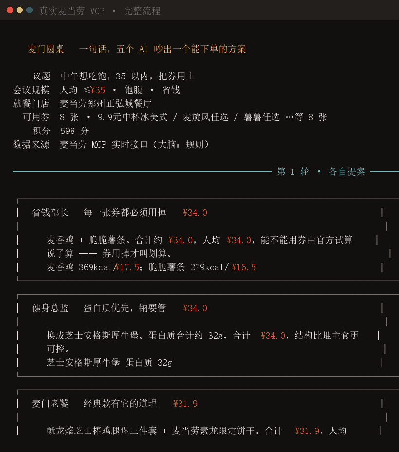
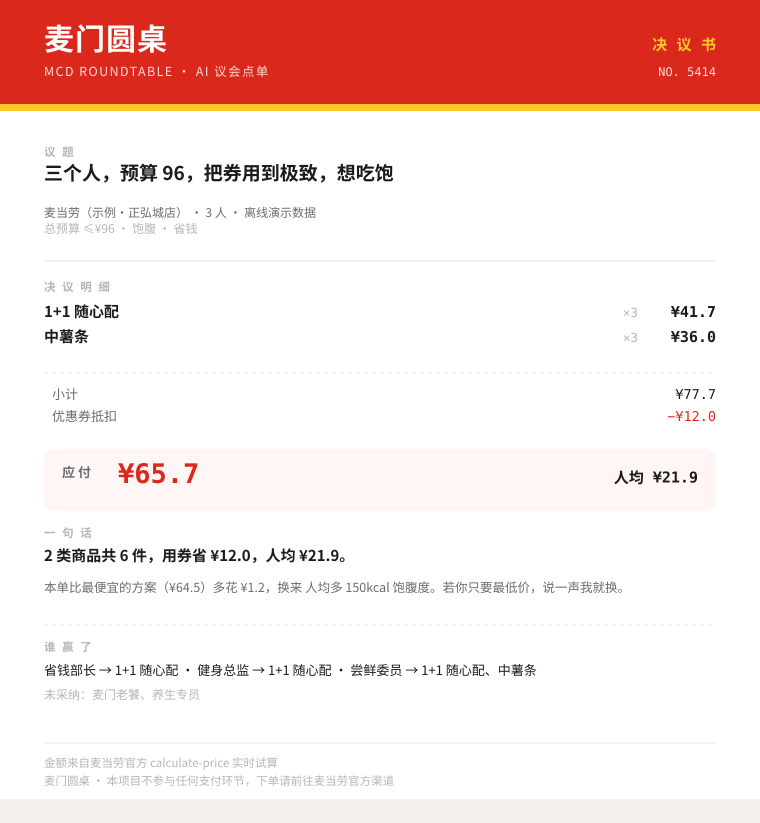
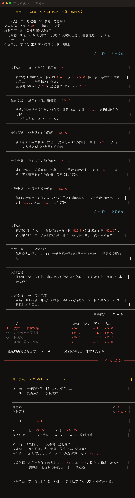
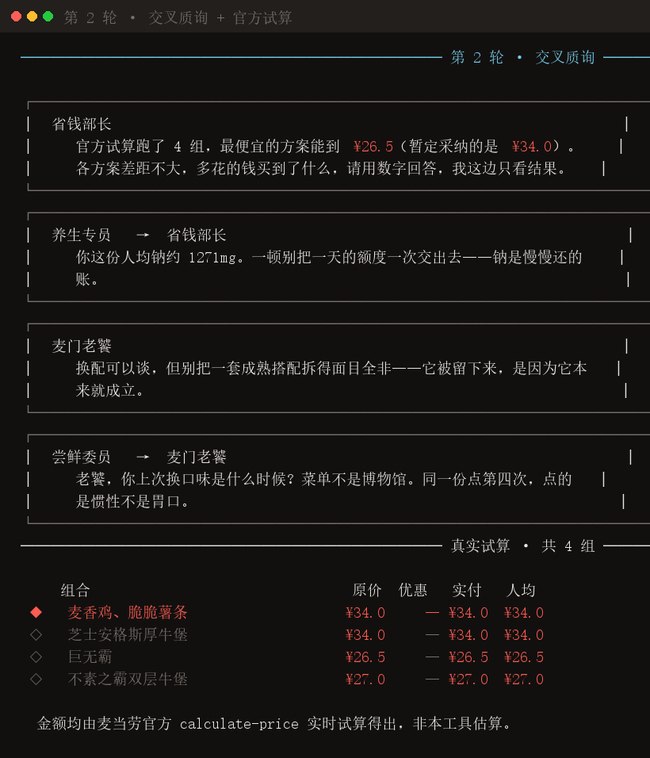
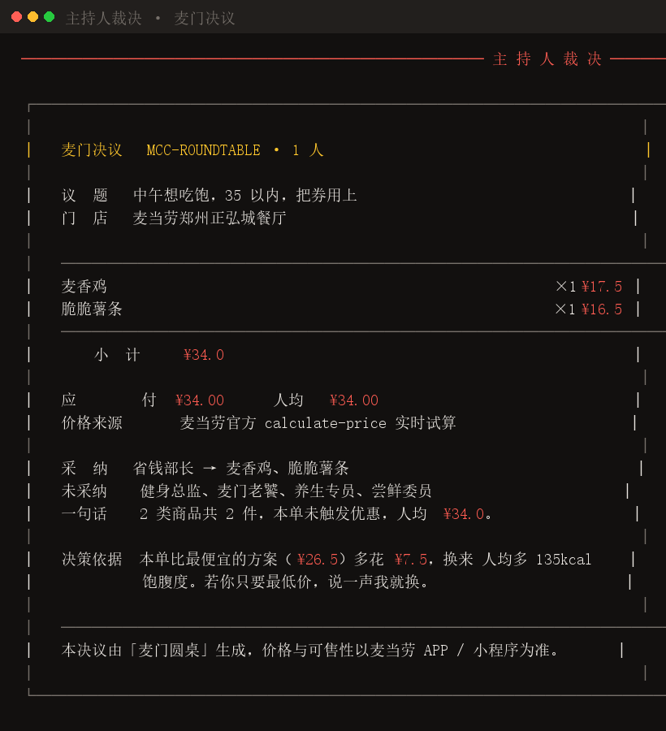
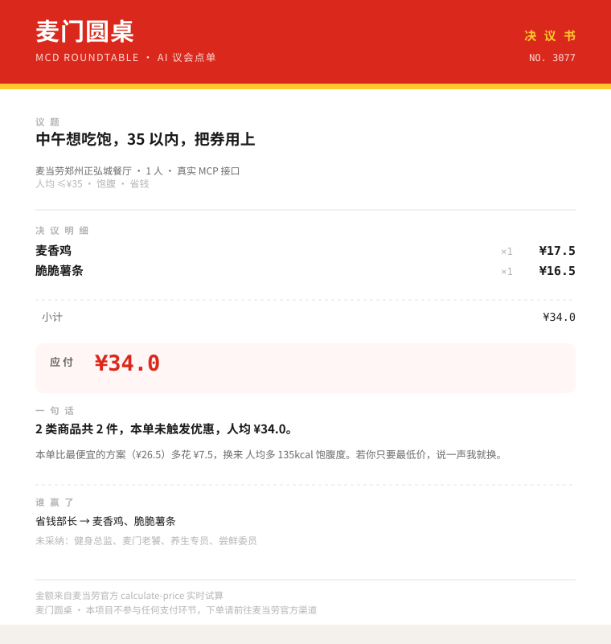
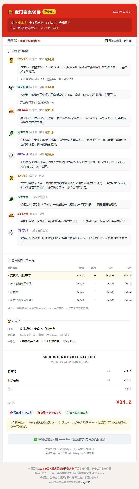
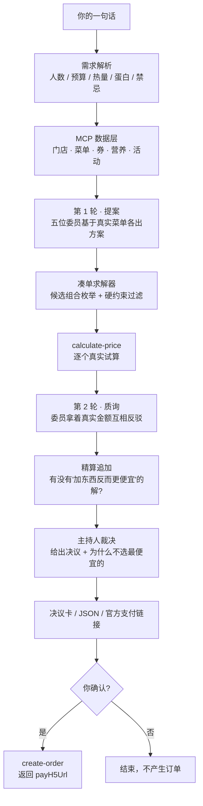

<div align="center">

# 麦门圆桌 · mcd-roundtable

**你只说一句话，五个 AI 人格当场吵起来，最后吵出一个真能下单的结果。**

席位：💰 省钱部长 · 🏋️ 健身总监 · 🍔 麦门老饕 · 🌿 养生专员 · 🎲 尝鲜委员


</div>

<!-- 演示动画：由 tools/render_demo_gif.py 从真实运行输出录屏生成，非剪辑 -->


> 上面这段滚动播放的画面，是程序在**真实麦当劳 MCP** 上的实际输出，没有剪辑。
> 门店、菜单、券、价格全部来自真实接口（这次是麦当劳郑州正弘城餐厅）。

---

## 三十秒看懂

```bash
pip install -r requirements.txt && python -m mcd_roundtable --demo "中午想吃饱，30 以内，把券用上"
```

**不需要任何 Token，不需要联网。** 坐下来看完五位委员吵完一架，你就能决定今天中午吃什么。

<!-- 决议卡：由 `--share` 直接导出，可截图、可贴群、可发朋友圈 -->


> 上面这张「麦门决议卡」不是设计稿，是程序的输出：
> `mcd-roundtable --share card.svg "..."` 会把你这次的结论导成一张自包含 SVG。

---

## 它到底做了什么

一句话点餐的工具已经很多了。**这个项目想解决的是另一个问题：午餐没有唯一正确答案。**

你在意的是价格、是蛋白质、是"就想吃那口"，还是纯粹吃腻了——这是四种互相冲突的立场。
把它们塞进一个 prompt 让模型"综合一下"，结果就是四平八稳的和稀泥。

所以这里把它们**拆成五个会吵架的人**：

| 委员 | 立场 | 他的武器 |
| :---: | --- | --- |
| 💰 **省钱部长** | 每一张券都必须用掉 | 官方算价接口的**真实优惠金额** |
| 🏋️ **健身总监** | 蛋白质优先，钠要管 | 官方营养表（热量 / 蛋白质 / 钠） |
| 🍔 **麦门老饕** | 经典款有它的道理 | 菜单里的常青款与套餐结构 |
| 🌿 **养生专员** | 少油少钠，能换就换 | 换配空间 + 钠含量横向对比 |
| 🎲 **尝鲜委员** | 你每次都点一样的 | 官方菜单分类里的「人气热卖 / 招牌」标签（刻意避开大众款） |

吵完之后，一位中立的主持人（**确定性求解器**）来定案。

---

## 两条硬规矩

这个项目有一句贯穿始终的原则：

> ### 模型负责「吵」，麦当劳 MCP 负责「算」。

**规矩一：菜单里没有的东西，一个字都不许提。**
委员的提案只能从 `query-meals` 返回的真实菜单里选，编造出来的菜品会被直接剔除。

**规矩二：金额只能来自官方 `calculate-price`，不允许模型估算。**
券的组合规则很容易算错，而算错的账会让人真的多花钱。所以：

* 本地只用真实菜单价做**粗排**，选出 Top-K 候选组合；
* 候选逐个调用官方 `calculate-price` **真实试算**；
* 最终排序、优惠金额、"再凑多少更划算"，全部以官方返回为准；
* 万一试算接口挂了，兜底价会被显式标注为 `local-fallback`，**绝不冒充官方价格**。

---

## 三个别处看不到的细节

### 1️⃣ 反直觉解：加东西反而更便宜

官方算价接口会返回「距离下一档优惠还差多少钱」（`enjoyable.balance`）。
只要差的那点钱小于优惠增量，**多买一件反而实付更少**。

```
💡 再点 ¥3.2 跨到下一档优惠，实付净降 ¥2.8（官方试算口径）
```

（实测可复现：`mcd-roundtable --demo "两个人，预算 50"`）

净降 = 跨档能拿到的优惠 − 已经拿到的优惠 − 为跨档多花的钱。
**三项都要减**，少减任何一项都会把"多花 3.2 元"说成"净降 6 元"——
而这句话是要拿去做购买决策的。

这个账人手算不出来，但它真实存在。程序会主动去找这个解，找到就直接改写决议。

### 2️⃣ 说清楚"为什么没给你选最便宜的"

```
决策依据  本单比最便宜的方案（¥64.5）多花 ¥1.2，
          换来 人均多 150kcal 饱腹度。若你只要最低价，说一声我就换。
```

一个"什么都说不清就替你选贵的"的工具是不值得信任的。
所以只要能给出**量化理由**就必须给出；给不出就闭嘴，不编理由。

### 3️⃣ 约束没达成就直说，不假装满足

"蛋白质 30g 以上"这一条在当前预算下可能无解。
这时它不会偷偷把目标改成 25g 再宣布成功，而是：

```
⚠ 蛋白质约 26g/人，未达 30g 目标（在当前热量与预算上限下，这已是菜单里最接近的搭配）
```

（实测可复现：`mcd-roundtable --demo "三个人，预算 60，蛋白质 30g 以上"`）

营养表没覆盖到某道菜时，它也会说「无法核验」，而不是拿 0 当真实值报警。

---

## 真实模式跑起来是什么样

配好 Token 之后，同一套流程走的是麦当劳官方 MCP，下面是一次**真实运行**的输出：



其中真正体现思路的是这两段 —— 委员拿着官方算出来的真金白银互相质询，
以及最后那张能直接照着下单的小票：





同一份决议加 `--share` 就能导出成一张自包含的 SVG 决议卡，可直接发群里：



> **关于「优惠 —」：** 这不是 bug。该账号手上的券是"9.9 元中杯冰美式"这类**单品特价券**，
> 与本次选中的餐品不匹配，官方接口如实返回 0。
> 本工具的原则是**不编造优惠** —— 券能不能用，由 `calculate-price` 说了算。

---

## 把决议变成一张能发出去的网页

终端输出有个天然缺陷：**它传播不出去**。截图带终端边框和滚动条，抄成文字又丢掉全部排版。

所以加一个 `--html`，把整场会议导成**单文件网页**：

```bash
mcd-roundtable "中午想吃饱，35 以内，把券用上" --city 郑州 --keyword 正弘城 --html verdict.html
```



（上面这张是**整页 1:1 截图**：页面本身是单栏文档、`max-width: 660px`，
所以竖着长。放大看能读清每一个数字。）

打开时五位委员会依次"冒出来"发言（每人一个专属配色徽章），最后落一张带**锯齿撕边**的小票。
这次运行如果带了 `--order`，小票底部的按钮会变成金色，直接跳转麦当劳官方支付页。

这份 HTML 有三个刻意的工程选择：

| 选择 | 为什么 |
| --- | --- |
| **零 JavaScript** | 动画全部用 CSS `animation-delay` 做，内容在生成时就已渲染进 HTML。**禁用 JS 也完整可读**，不会出现"打开是一片白"。 |
| **全部文本转义** | 菜名来自 MCP、诉求来自用户输入。直接拼进 HTML 既会断版（菜名带 `&`、`<`）也可能被注入，所以一律走 `html.escape`。 |
| **单文件、零外部请求** | 没有 CDN、没有外部字体、没有 `<script src>`。断网、离线、丢进邮件附件都能正常打开。 |

> 不想跑代码也可以直接看样例：[`assets/sample-verdict.html`](./assets/sample-verdict.html)
> —— 就是上面那张图背后的真东西，也是真实运行导出的一份。

---

## 实测踩到的坑（给要接麦当劳 MCP 的人）

这一节可能比代码本身更省你时间。以下每一条都是**真的踩过、并且验证过**的。

### 坑 1：字段名错了不报错，只静默返回 0

`calculate-price` / `create-order` 的 items 元素字段是 **`productCode`**：

```jsonc
// ✗ 不报错，price 静默返回 0
{"items": [{"mealCode": "1440", "quantity": 1}]}
{"items": [{"code": "1440", "quantity": 1}]}

// ✓ 正确
{"items": [{"productCode": "1440", "quantity": 1}]}
```

这是最难排查的一类问题：**没有异常、没有错误码，只有 0**。

### 坑 2：金额单位不统一

| 接口 | 单位 |
| --- | --- |
| `query-meals` → `currentPrice` | **元**（字符串） |
| `calculate-price` → `price` / `discount` / `subtotal` | **分**（整数） |

混用会让"29 元套餐"变成"0.29 元"。本项目在接入层统一换算成元，内部只流转元。

### 坑 3：到店下单必须带 `takeWayCode`

`create-order` 在 `orderType=1`（到店 / 得来速）下漏传 `takeWayCode` 会直接报 **`600042`**。
这个值**只能**从 `calculate-price` 返回的 `takeWayList[].code` 里取：

```jsonc
"takeWayList": [
  {"code": "eat-in",        "title": "堂食", "subtitle": "店内用餐"},
  {"code": "take-in-store", "title": "外带", "subtitle": "店内自提"}
]
```

实测：先 `calculate-price` 拿到取餐方式 → 再 `create-order` 带上它，才能拿到 `payH5Url`。
（`cancel-order` 同理，`cancelReasonCode` 是必填，漏传报 400。）

### 坑 4：返回格式有四种，不能直接 `json.loads`

| 格式 | 例子 |
| --- | --- |
| 纯 JSON | `query-my-account` |
| 一段说明文字 + JSON | `query-nearby-stores`、`calculate-price` |
| Markdown | `available-coupons`、`campaign-calendar`、`query-my-coupons` |
| toon 紧凑表格 | `list-nutrition-foods` |

特别是 `calculate-price`，它会在 JSON 前面贴一大段 `# API Response Information` 字段说明。
`json.loads` 整串必然失败，得用 `raw_decode` 从第一个 `{` 开始解析。

toon 表格长这样（开头的 `[160]` 是条数，表头不以 `{` 开头，要单独处理）：

```
[160]{productName,nutritionDescription,energyKj,energyKcal,protein,...}:
  猪柳麦满分,null,1288,308,16,16,24,781,213
```

### 坑 5：`query-nearby-stores` 必须**同时**给 `city` 和 `keyword`

只给一个会报 `600058 城市名或者关键词不能为空`。
另外 `beType=2`（麦乐送到家）走这个接口会报 `600046 仅支持到店和得来速`。

### 坑 6：`query-my-coupons` **完全没有** `couponId`

它的返回是一份给人看的清单，只有标题、优惠价、有效期：

```markdown
## 9.9元中杯冰美式
- **优惠**: ¥9.9 (用券价格)
- **有效期**: 2026-10-09 00:00-2026-10-15 23:59
- **标签**: 到店专用、外送专用
```

**没有 `couponId`，也没有 `couponCode`。** 只有 `query-store-coupons` 才带标识。
本项目把两者分开处理：带 ID 的可以传回官方接口，只有名字的仅用于展示。

### 坑 7：`list-nutrition-foods` 不覆盖全部商品

套餐类商品常常查不到营养数据。
**绝对不能把缺失当成 0** —— 否则"热量 < 200kcal"之类的硬约束会把整类商品误杀，
表现为"菜单里明明有饭，求解器却说没有主食可选"。

本项目的处理：数据缺失时跳过热量硬约束、只做轻微扣分，并在结论里说明"无法核验"。

---

## 快速开始

### 1. 申请麦当劳 MCP Token

访问 **<https://open.mcd.cn/mcp>** → 右上角登录 → 控制台 → 激活 → 复制 Token。

> ⚠️ 注意别拿错：**MCP Token** 和 **大模型 API Key** 是两回事。
> 本项目实测过：把 LLM Key 当 MCP Token 用会返回 `400008 当前authToken不允许超过64位长度`。

### 2. 安装

```bash
git clone https://github.com/693696817/mcd-roundtable.git
cd mcd-roundtable
pip install -r requirements.txt
```

### 3. 先不开 Token 看一眼

```bash
# 零配置，离线跑通全流程
python -m mcd_roundtable --demo "中午想吃饱，30 以内，把券用上"
```

### 4. 接真实数据

```bash
export MCD_MCP_TOKEN="你的 MCP Token"

# ⚠️ city 与 keyword 必须同时给
mcd-roundtable --city 郑州 --keyword 新华书店 "中午想吃饱，35 以内，把券用上"
```

想用 LLM 生成更自然的话术（不配也能跑，会退回规则大脑）：

```bash
export ROUNDTABLE_LLM_API_KEY="sk-..."
export ROUNDTABLE_LLM_BASE_URL="https://api.deepseek.com/v1"   # 任意 OpenAI 兼容端点
export ROUNDTABLE_LLM_MODEL="deepseek-chat"
```

---

## 命令行

```bash
# 一句话点餐（真实模式）
mcd-roundtable --city 郑州 --keyword 新华书店 "中午想吃饱，30 以内，把券用上"

# 只留两位委员，让它吵得更凶
mcd-roundtable "三个人，预算 60，把券用到极致" --roles saver,macro

# 减脂期
mcd-roundtable "减脂期，单餐 600kcal 以内，蛋白质 30g 以上" --roles macro,light --objective protein

# 团队订餐
mcd-roundtable "团队 8 人午餐，预算 300" --people 8 --rounds 2

# 导出可截图的决议卡
mcd-roundtable "随便来点" --share card.svg

# 导出可以直接发给别人的交互式网页
mcd-roundtable "随便来点" --html verdict.html

# 确认方案后下单，拿官方支付链接
mcd-roundtable "随便来点" --order

# 结构化输出，方便被别的 Agent / 工作流调用
mcd-roundtable "随便来点" --json
```

| 参数 | 说明 |
| --- | --- |
| `--demo` | 离线演示，不联网、不需要 Token |
| `--roles` | 参与委员，逗号分隔，默认全部 |
| `--people` | 人数，默认 1 |
| `--budget` / `--per-person` | 总预算 / 人均预算 |
| `--rounds` | 质询轮数，默认 1，最大 3 |
| `--objective` | 优化目标：`cost` / `protein` / `balanced` |
| `--brain` | 话术大脑：`auto` / `llm` / `heuristic` |
| `--city` `--keyword` | 门店定位（真实模式需**同时**提供） |
| `--delivery` | 按外送而非到店自取试算 |
| `--share PATH` | 导出 SVG 决议卡 |
| `--html [PATH]` | 导出交互式决议网页（单文件、离线可看）；省略路径则用 `mcd-verdict.html`。**把需求写在它前面** |
| `--order` | 调用 `create-order`，返回麦当劳官方支付链接 |
| `--json` | 结构化 JSON 输出 |
| `--no-color` | 纯文本，便于重定向 |

---

## 工作流程



注意流程里**质询排在试算之后**：委员先看到官方算出来的真金白银，再开口吵架。
这样的反驳每一句都落在真实数字上，而不是空对空的人格表演。

| 阶段 | 谁负责 | 产出 |
| --- | --- | --- |
| 数据采集 | 麦当劳 MCP | 菜单 / 券 / 营养 / 活动（唯一事实来源） |
| 提案与质询 | 多角色 LLM（或规则大脑） | 各立场方案与论据 |
| 求解与验价 | 确定性代码 + `calculate-price` | 真实可下单的最优组合 |
| 下单 | 你确认 + `create-order` | 官方支付链接 |

---

## 项目结构

```
mcd-roundtable/
├── README.md                    # 项目介绍 / 安装方法 / 使用示例 / 目标用户
├── CONTEST_DECLARATION.md       # 参赛声明（官方模板，内容不可改动）
├── MCP_INTEGRATION.md           # MCP 接入说明：用到的工具、调用时序、业务价值
├── mcp-config.example.json      # MCP 配置示例（只含环境变量占位符）
├── workbuddy.md                 # 使用 WorkBuddy 开发的过程记录
├── LICENSE
├── requirements.txt
├── pyproject.toml
├── assets/                      # README 配图：全部由程序输出生成，不是手绘的
│   ├── demo.gif                 # 演示动画（真实输出的滚动录屏）
│   ├── html-report.png          # 决议网页整页截图（单栏文档，1:1 可读）
│   ├── sample-verdict.html      # 决议网页样例（可直接双击打开）
│   ├── terminal-live.png        # 真实模式全流程
│   ├── terminal-debate.png      # 第 2 轮质询 + 真实试算
│   ├── terminal-verdict.png     # 主持人裁决小票
│   ├── decision-card.svg        # 演示模式导出的决议卡
│   └── live-card.svg            # 真实模式导出的决议卡
├── examples/
│   └── regression.py            # 回归：纯函数单测 + 5 个端到端场景
├── tools/                       # 开发期工具，不是运行时依赖
│   ├── render_terminal_png.py   # 终端输出 → PNG
│   ├── render_demo_gif.py       # 终端输出 → 演示 GIF
│   └── check_width.py           # 校验列宽与行首禁则
└── src/mcd_roundtable/
    ├── cli.py                   # 命令行入口
    ├── mcp_client.py            # MCP 接入层：脏文本解析 + 金额口径统一
    ├── demo_data.py             # 离线演示数据（与真机**同构的原始报文**）
    ├── models.py                # 领域模型（含中文类目名归一化）
    ├── roles.py                 # 五位委员的人格与打分
    ├── council.py               # 议会编排：提案 → 试算 → 质询 → 裁决
    ├── optimizer.py             # 券约束下的凑单求解器
    ├── card.py                  # 决议卡 SVG 导出
    ├── html_report.py           # 交互式决议网页导出（单文件、零 JS）
    └── render.py                # 终端渲染
```

> `assets/` 里的图**没有一张是手工画的**：GIF 和终端截图是
> `tools/render_demo_gif.py` / `tools/render_terminal_png.py` 把程序真实输出录下来的，
> 决议卡是 `--share` 自己导出的。程序改了，图就跟着变，不会出现"图文不符"。

### 一个刻意的设计：`--demo` 不返回对象，返回**原始报文**

`demo_data.py` 里没有一条"现成的数据"，只有与真机**格式完全一样**的响应文本——
包括那段啰嗦的 `# API Response Information` 前缀、Markdown 券清单、toon 营养表。

好处是 `--demo` 会真实地走一遍解析层：
**解析相关的 bug 在离线阶段就会暴露，不会等到你配好 Token 才炸。**
金额口径也照抄真机：菜单是元，算价是分。

---

## 三道门禁

这个项目最怕的不是崩溃，是**静默算错钱**。所以每次改动都要过三关：

```bash
python -m compileall -q src examples tools   # ① 编译
python examples/regression.py                # ② 回归
python tools/check_width.py                  # ③ 版式
```

**② 回归**分两层，因为失败模式不同：

| 层 | 查什么 | 为什么单独一层 |
| --- | --- | --- |
| **纯函数单测** | 金额单位（分/元）、千分位、脏返回的四种格式、忌口解析、终端标记注入、净收益公式、HTML 转义 | 不起进程，秒级定位。这里固化的每一条都对应一个**真实踩过并且修好**的坑 |
| **端到端场景** | 5 种提问 × 7 条不变量（明细合计 == 小计、必须有主食、价格来源必须是官方接口……） | 抓"函数都对、拼起来不对"的问题 |

写这些断言的时候做过**负向对照**：把修好的地方改回旧写法，断言必须报红。
否则测试只是装饰——一个永远通过的测试，和没有测试是一样的。

> 有两条断言专门盯着**"财务静默错误"**：
> 一是"再点 ¥X 净降 ¥Y"里的 `Y` 必须把已得优惠和跨档多花的钱都减掉；
> 二是本地兜底价必须显式标注成 `local-fallback`，绝不能冒充官方价格。
> 这两处错都不会抛异常，只会让人多花钱。

---

## 目标用户

- **每天为午饭纠结的上班族** —— 尤其是有同事一起、需要"好分餐 + 好算账"的场景
- **麦门深度用户** —— 手里攒了一堆券和积分，但总在过期前才想起来
- **有明确饮食目标的开发者** —— 减脂、增肌、控糖控钠，需要量化而不是感觉
- **AI Agent 开发者** —— `--json` 输出可以直接被其他 Agent 或工作流调用

---

## 合规与边界

这一节直接对着活动规则里「内容合规」的每一条自查：

| 规则关注点 | 本项目的做法 |
| --- | --- |
| 不侮辱、贬低品牌，不与其他品牌对比 | 五位委员全部是**建设性角色**，没有任何一位以贬损餐品或品牌为立场；全项目不含品牌对比表述 |
| 不宣扬不健康饮食方式 | 不做"少吃 / 节食"导向。`养生专员` 的主张是**换配**（换饮品、换配菜、去酱）来达成平衡，而不是劝人别吃快餐 |
| 不宣扬奢靡浪费、拜金 | 核心目标是**花更少的钱吃到合适的量**。凑单提示只在「净收益为正」时才出现 —— 多花钱的提示会被主动屏蔽 |
| 不含迷信内容 | 委员的每一条理由都能追溯到菜单、官方营养表或官方算价结果，没有"运势 / 吉凶"式说法 |
| 无恶意代码、钓鱼链接 | 纯本地 CLI，无网络回连、无外链跳转、不下单不支付（除非用户显式加 `--order`） |

其它边界：

- 本项目**由参赛者独立开发，非麦当劳官方产品**。
- 不涉及任何支付环节：`--order` 只调用官方 `create-order` 并返回**麦当劳官方**支付链接，
  本项目不接触、不保存任何支付凭证。
- 所有餐品、价格、优惠、营养数据均来自麦当劳官方 MCP 接口，不抓取、不缓存、不转售。
- 输出仅供参考，**不构成医疗、营养或其他专业建议**；
  餐品信息、价格及供应状态以麦当劳官方渠道的实时结果为准。
- 仓库内**不含任何真实 Token / 密钥**，`mcp-config.example.json` 只使用环境变量占位符。
- 开发期调用 `create-order` 产生的测试订单已即时用 `cancel-order` 取消，不留未支付订单。

---

## 交流与支持

- 💬 **开发者微信：`zyj118`** —— 欢迎麦友交流、技术探讨、Bug 反馈（加好友请备注「麦门圆桌」）
- ⭐ 如果这个项目帮你在中午做出了决定，**给个 Star** 就是对作者最好的鼓励
- 🐛 发现问题或想要新功能，欢迎直接开 Issue

> 本项目是 **2026 麦当劳程序员创意开发大赛** 参赛作品，
> 而 Star 数正是这个比赛的排名依据 —— 所以你觉得有意思的话，那一下 Star 是实打实的支持。

---

## 参赛信息

本项目为 **2026 麦当劳程序员创意开发大赛** 参赛作品，基于麦当劳中国官方 MCP Server 开发，
开发过程使用 **腾讯 WorkBuddy** 辅助完成。

活动规则要求的文件，本仓库全部齐备：

| 序号 | 文件 | 说明 |
| ---: | --- | --- |
| 1 | [`README.md`](./README.md) | 项目介绍 / 安装方法 / 使用示例 / 目标用户（即本文） |
| 2 | [`CONTEST_DECLARATION.md`](./CONTEST_DECLARATION.md) | 参赛声明，**使用官方模板、内容未做任何改动** |
| 3 | [`MCP_INTEGRATION.md`](./MCP_INTEGRATION.md) | 实际使用的 MCP Server / Tool、调用流程、业务价值 |
| 4 | [`mcp-config.example.json`](./mcp-config.example.json) | 脱敏配置示例，只含 `${MCD_MCP_TOKEN}` 环境变量占位符 |
| 5 | [`src/mcd_roundtable/`](./src/mcd_roundtable) | 项目源代码（可运行） |
| 6 | [`workbuddy.md`](./workbuddy.md) | WorkBuddy 开发对话上下文（用于 WorkBuddy 专项奖励核验） |

- **真实使用了麦当劳 MCP**：`query-nearby-stores` / `query-meals` / `list-nutrition-foods` /
  `available-coupons` / `query-my-coupons` / `calculate-price` / `create-order` / `cancel-order`
  等，完整调用时序见 [`MCP_INTEGRATION.md`](./MCP_INTEGRATION.md)。
- **真实使用了腾讯 WorkBuddy** 完成开发，过程记录见 [`workbuddy.md`](./workbuddy.md)。

## License

MIT
